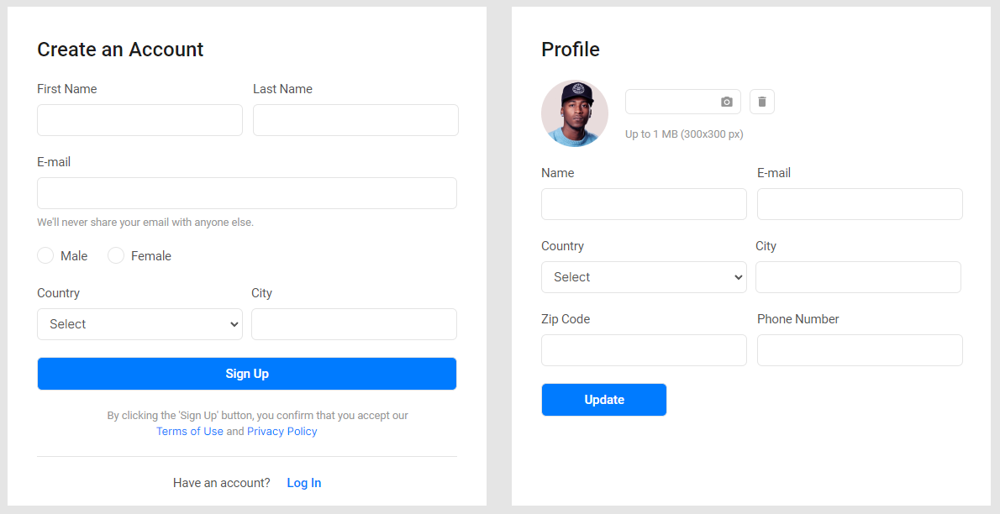

<h2 justify="center">Hey there! I'm Volodymyr, Front-End Developer from Odessa,Ukraine</h2>

<!-- ## 👋 &nbsp;Hey there! I'm Volodymyr-->

### 👨🏻‍💻 &nbsp;About Me

💡 &nbsp;I like to explore new technologies and develop software solutions and quick hacks.\
🎓 &nbsp;I'm completed [Beetroot Academy](https://beetroot.academy/ "Beetroot Academy")\
🌱 &nbsp;I'm on track for learning more and more about Web Development.\
💬 &nbsp;Feel free to reach out to me for some interesting discussion.\
✉️ &nbsp;You can shoot me an email at [zadorozhniiv@gmail.com](zadorozhniiv@gmial.com)! I'll try to respond as soon as I can.\
📄 &nbsp;Please have a look at my [CV](./documents/CV_FrontEnd_Zadorozhnii_V.pdf) for more details about me. I'm open to feedback and suggestions!
__
 

### 🛠 &nbsp;Tech Stack
&nbsp;
&nbsp;
&nbsp;
&nbsp;
&nbsp;
&nbsp;
&nbsp;
&nbsp;
&nbsp;
&nbsp;
&nbsp;
&nbsp;
&nbsp;
&nbsp;

 
 

### ⚙️ &nbsp;GitHub Analytics

### 🤝🏻 &nbsp;Connect with Me

___

<h3>My last works:<h3> 

                

                    

                        <h3 class="slot__title center">"Game Store"</h3>
                        
                    

                    

                        <a href="https://633249ae90ffb62396bbf875--luminous-crisp-f0c51c.netlify.app/"
                            rel="noindex nofollow noreferrer">Visit site</a> ||
                        <a href="https://github.com/ZadorozhniiVova/GameStore"
                            rel="noindex nofollow noreferrer">Show code</a>
                    

                     
                    

                        This is Game Store site, based on The RAWG API.
                        User can search any game, if he registered on site(realized by Firebase with email and password) add to favorite and buy it in available platform.
                        There is also a search by filters: platforms, release date and by rating;
                        The site was developed using the following technologies: Vue.js, Vuex, Vue CLI, Axios, Routers, Bootstrap, Vuetify, Hooper Slider, SCSS(mixins,variables), Vanilla.js, Firebase.
                    

                

                 
                

                    

                        <h3 class="slot__title center">"Pages"</h3>
                        
                    

                    

                        <a href="https://zadorozhniivova.github.io/Brightech/"
                            rel="noindex nofollow noreferrer">Visit site</a> ||
                        <a href="https://github.com/ZadorozhniiVova/Brightech"
                            rel="noindex nofollow noreferrer">Show code</a>
                    

                     
                    

                        This site was created with using semantic HTML (BEM), SCSS, JS (mixins,variables).The icons were made in SVG sprite format.  The site is adaptive and responsive, designed according to Figma
                        layout with templates for different devices (pixel perfect).
                    

                

                 
                

                    

                        <h3 class="slot__title center">"Monticello"</h3>
                        
                    

                    

                        <a href="https://zadorozhniivova.github.io/Portfolio/Monticello/index.html"
                            rel="noindex nofollow noreferrer">Visit site</a> ||
                        <a href="https://github.com/ZadorozhniiVova/Portfolio/tree/main/Monticello"
                            rel="noindex nofollow noreferrer">Show code</a>
                    

                     
                    

                        This site was created with using semantic HTML (BEM, not adaptive), SCSS, JS,
                        jQuery, Stick Slider, Google Maps Api and jQuery validation. This site was developed by
                        a team of 4 people, and we worked in parallel. Each had its own separate branch in Git
                        and one repository, in which we made changes using a pull request. The project was
                        posted on Github Pages.
                    

                

                 
                

                    

                        <h4 class="slot__title center">"Bhromaon"</h4>
                        
                    

                    

                        <a href="https://zadorozhniivova.github.io/Portfolio/Bhromaon/index.html"
                            rel="noindex nofollow noreferrer">Visit site</a> ||
                        <a href="https://github.com/ZadorozhniiVova/Portfolio/tree/main/Bhromaon"
                            rel="noindex nofollow noreferrer">Show code</a>
                    

                     
                    
This site without JS. This is a responsive, adaptive and cross-browser
                        landing page created using CSS, semantic HTML, strictly according to the BEM
                        methodology and according to templates for different screen extensions (pixel perfect).
                        The icons were made in SVG sprite format. Standard validation was also added to the
                        form.

                

                 
                

                    

                        <h4 class="slot__title center">"Manifest"</h4>
                        
                    

                    

                        <a href="https://zadorozhniivova.github.io/Portfolio/Manifeste/index.html"
                            rel="noindex nofollow noreferrer">Visit site</a> ||
                        <a href="https://github.com/ZadorozhniiVova/Portfolio/tree/main/Manifeste"
                            rel="noindex nofollow noreferrer">Show code</a>
                    

                     
                    

                        This is a landing page written without pre-processors - only pure CSS, in semantically
                        correct HTML (BEM). The site is adaptive and responsive, designed according to Figma
                        layout with templates for different devices.
                    

                

                

                    

                        <h4 class="slot__title center">"Registration Form"</h4>
                        
                    

                    

                        <a href="https://zadorozhniivova.github.io/Portfolio/Registration/index.html"
                            rel="noindex nofollow noreferrer">Visit site</a> ||
                        <a href="https://github.com/ZadorozhniiVova/Portfolio/tree/main/Registration"
                            rel="noindex nofollow noreferrer">Show code</a>
                    

                     
                    

                        This is a registration window written without pre-processors - only pure CSS, in semantically
                        correct HTML (BEM). The site is adaptive and responsive, designed according to Figma
                        layout with templates for different devices. Added validation check for all inputs.
                    

                

